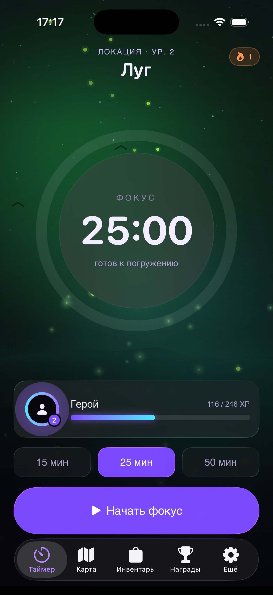
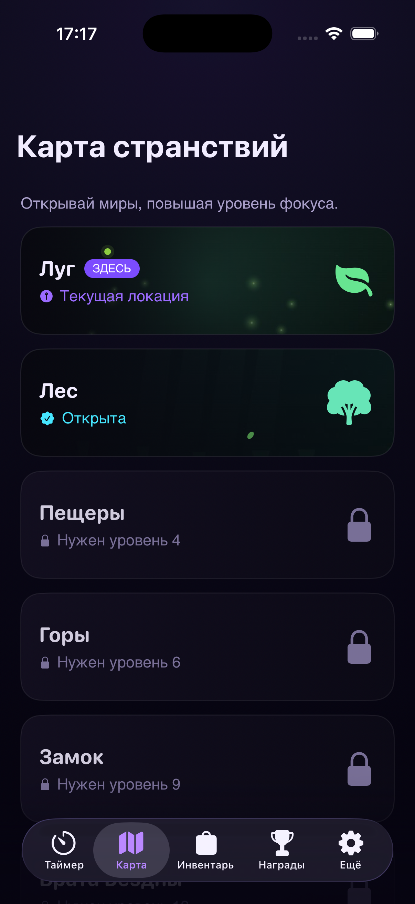
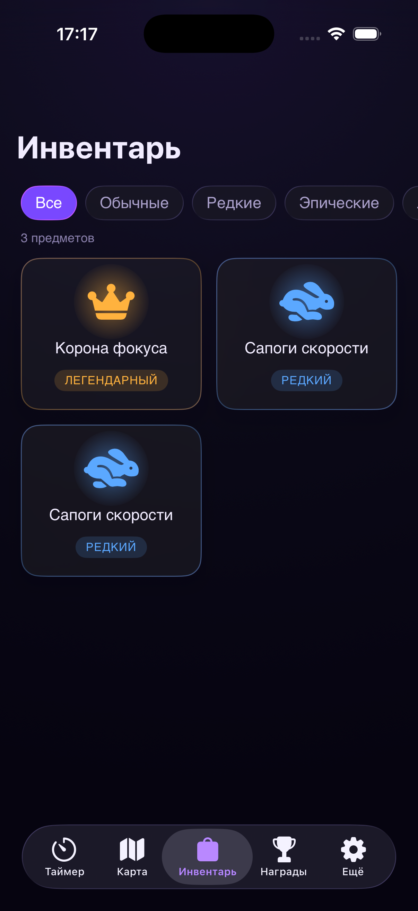
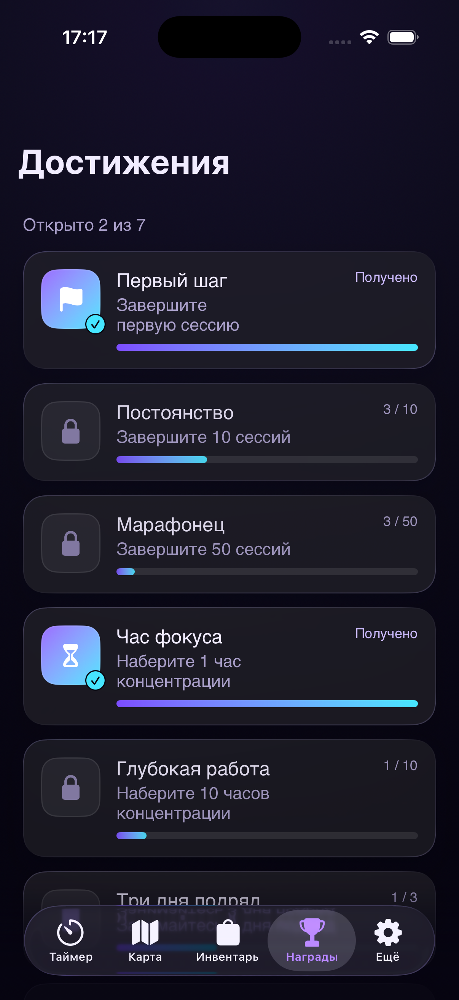
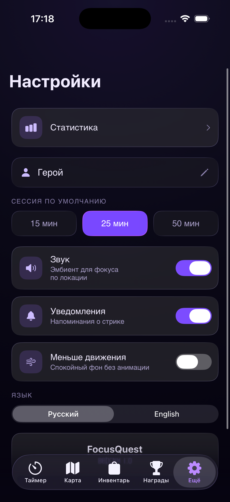
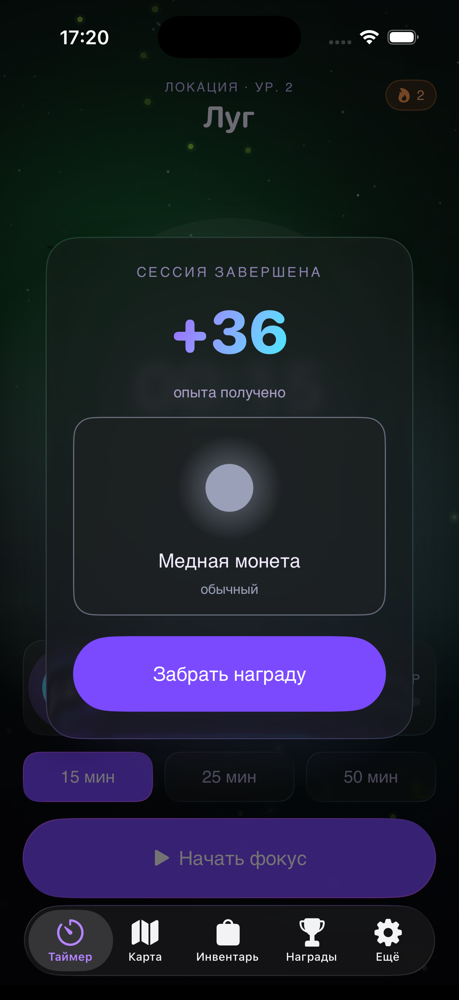
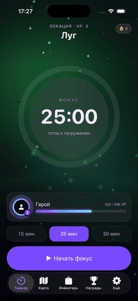

<h1 align="center">FocusQuest</h1>

<a href="README.md">English</a> · <a href="README.ru.md">Русский</a>

  
  
  
  
  

Pomodoro-таймер с RPG-геймификацией в стиле тёмного фэнтези. 
За выполненные сессии фокуса персонаж качает уровни, открывает локации,
собирает предметы и достижения. Под фокус играет lofi-эмбиент.

## Экраны

<table>
  <tr>
    <td align="center"> Карта странствий</td>
    <td align="center"> Инвентарь</td>
    <td align="center"> Достижения</td>
  </tr>
  <tr>
    <td align="center"> Настройки</td>
    <td align="center"> Награда за сессию</td>
    <td align="center"> В движении</td>
  </tr>
</table>

<!-- Скриншоты и demo.gif кладутся в docs/screenshots/ (см. .gitkeep там). -->

## Что это

Приложение для управления фокус-сессиями (техника Pomodoro) с элементами RPG.
Идея простая: превратить рутину концентрации в маленькое приключение — каждая
завершённая сессия двигает персонажа вперёд, открывает новые места и даёт добычу.

Платформы: iOS 17+, macOS 14+. Внешних зависимостей нет.

## Что внутри

- Таймер считает оставшееся время от абсолютной `Date`, а не накоплением тиков —
  корректно переживает сворачивание, блокировку экрана и возврат в приложение.
- Прогрессия: опыт за сессию (с бонусом за отсутствие пауз), уровни, разблокировка
  шести локаций по уровню, выпадение предметов четырёх редкостей, семь достижений.
- Тёмно-фэнтезийный интерфейс: полноэкранные сцены локаций, свечения, кольцо
  таймера с пульсом, живые частицы под каждую локацию (светлячки, снег, искры, листья).
- Lofi-музыка под фокус — треки чередуются от сессии к сессии.
- Локализация RU/EN с мгновенным переключением в настройках.
- Экран статистики с недельным графиком фокус-времени.
- Live Activity и Dynamic Island с обратным отсчётом (опционально, отдельный Widget Extension).
- Учитывает системные «Уменьшение движения» и Dynamic Type.

## Архитектура

MVVM на Observation (`@Observable`), хранение — SwiftData (модели спроектированы
под будущую синхронизацию через CloudKit). Бизнес-логика вынесена в отдельные сервисы:
`TimerEngine`, `Progression`, `LootService`, `LocationService`, `AchievementService`,
`StatsCalculator`, `AudioService`, `NotificationService`. UI-слой (SwiftUI) построен
поверх них и переиспользует общую тему и токены дизайна.

## Сборка

Открыть проект в Xcode и запустить нужный таргет (симулятор iPhone или macOS).
Внешних зависимостей нет.

## Статус

В разработке, MVP.

## Ассеты и лицензии

- Lofi-музыка — CC0 1.0 (public domain).
- Арт локаций — плейсхолдер-иллюстрации, при желании заменяются финальными.
- Шрифты — Space Grotesk и Manrope (OFL); при их отсутствии используются системные.
